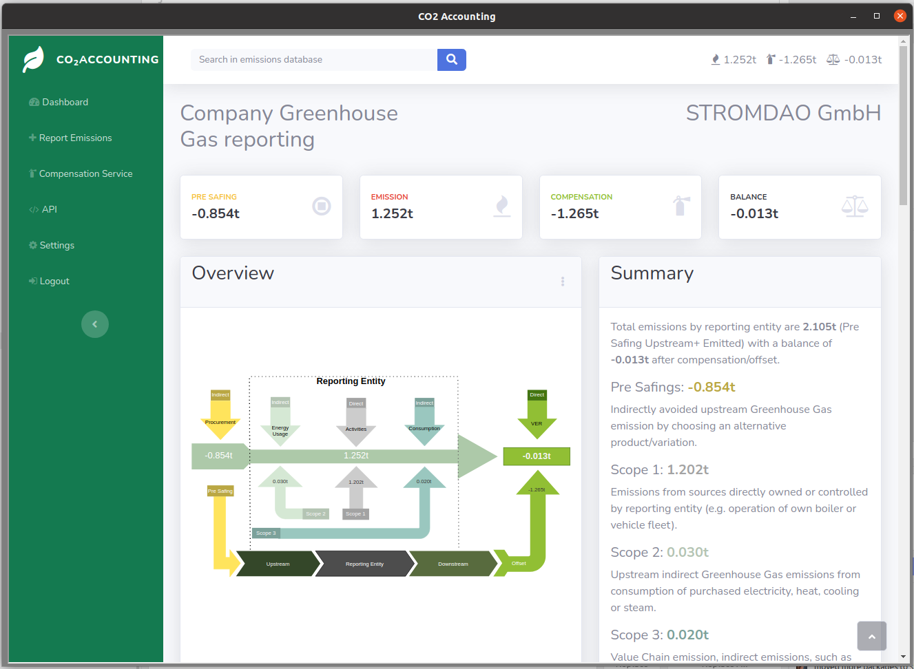

# [co2offset.io](https://co2offset.io/)
Carbon Dioxide Offset API

[](https://co2offset.io/badge.html?host=npm-co2offset.io)[](https://www.npmjs.org/package/co2offset.io)
[](https://npmcharts.com/compare/co2offset.io?minimal=true)[](https://snapcraft.io/co2offset)
[](https://snapcraft.io/co2offset)

## Get Your Badge.




## Installation for development
```
git clone https://github.com/energychain/co2offset.io.git
cd co2offset.io
npm install
```


## Contributing

Pull requests are welcome. For major changes, please open an issue first to discuss what you would like to change. Please make sure to update tests as appropriate. Details on [contributing](./CONTRIBUTING.md).

## Maintainer / Imprint

<addr>
STROMDAO GmbH  <br/>
Gerhard Weiser Ring 29  <br/>
69256 Mauer  <br/>
Germany  <br/>
  <br/>
+49 6226 968 009 0  <br/>
  <br/>
kontakt@stromdao.com  <br/>
  <br/>
Handelsregister: HRB 728691 (Amtsgericht Mannheim)
</addr>

Project Website: https://co2offset.io/

## LICENSE
[Apache-2.0](./LICENSE)
